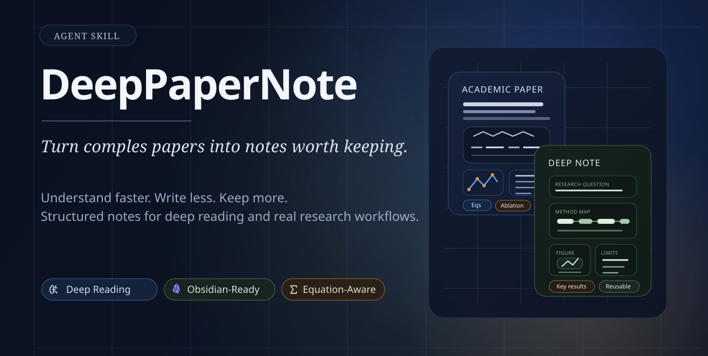

<div align="center">

# DeepPaperNote

**把本地論文 PDF 轉成有根據、有圖表、有結構的深讀 Markdown 筆記。**

[English](./README.md) | [繁體中文](./README.zh-CN.md)

[](https://917dhj.github.io/DeepPaperNote/)
[](https://github.com/917Dhj/DeepPaperNote)
[](https://github.com/917Dhj/DeepPaperNote/releases/tag/v2.0.0)
[](./LICENSE)
[](./SKILL.md)
[](./SKILL.md)
[](./references/figure-placement.md)
[](./references/model-synthesis.md)

</div>

[](https://917dhj.github.io/DeepPaperNote/)

DeepPaperNote 是一個專門處理 **本地 PDF 論文精讀** 的技能。它現在的預設場景很明確：你給 agent 一個本地 PDF 路徑，它在目前工作區內產生可保存、可檢查、可版本控制的 Markdown 筆記與配套圖片。

它不是一般的論文摘要器。目標是保留下列真正有用的內容：

- 論文到底在解決什麼研究問題
- 方法主線與技術機制
- 關鍵圖表，且圖與 caption 要對得上
- 重要實驗、限制與適用邊界
- 這篇論文放在既有研究脈絡中的位置

## 會產生什麼

對單篇 PDF，DeepPaperNote 會在目前工作區寫出三類產物：

- `raw/<note>.md`
- `raw/<note>.plan.json`
- `img/<note>/...`

預設要求：

- 筆記是 Markdown，語言為繁體中文、臺灣用語
- 所有圖檔放在 `img/<note>/`
- 筆記內的圖片連結要指向這些本地圖檔
- 能補 caption 的圖就要補 caption
- 只有在真實抽圖或重裁切都失敗後，才允許留下佔位符

## 預設輸入模型

現在的 **正常路徑** 是：

- 使用者直接提供本地 PDF 路徑
- 以 PDF 作為論文身份與內容的主要依據
- 元資料優先從 PDF 本身取得
- 只有 PDF 缺漏時，才用外部元資料補欄位

標題、DOI、arXiv、URL 這些輸入形式在某些環境中仍可作為相容模式，但它們已經不是此 skill 主要優化的工作流。

## 快速開始

### 1) 安裝 skill

```bash
npx skills add 917Dhj/DeepPaperNote
```

或指定安裝給特定 agent：

```bash
npx skills add 917Dhj/DeepPaperNote -a codex
npx skills add 917Dhj/DeepPaperNote -a claude-code
```

### 2) 安裝 PDF 核心依賴

```bash
python3 -m pip install PyMuPDF
```

### 3) 直接給本地 PDF

常見提示詞：

- `Use DeepPaperNote on /absolute/path/to/paper.pdf`
- `Read /absolute/path/to/paper.pdf and generate a deep-reading note`
- `幫我用 DeepPaperNote 整理這個 PDF：/absolute/path/to/paper.pdf`

## 輸出契約

一個成功的執行結果，通常應滿足這些條件：

- 每篇論文在 `raw/` 下有一份筆記
- 每篇論文在 `img/` 下有一個對應圖片目錄
- 筆記到圖片之間使用穩定的相對路徑連結
- 內容以證據為基礎，不只是重寫摘要
- 對證據缺失、說法不確定、抽取失敗要明確交代

如果某張圖是以真實圖片插入，那它應該是正確的那一張圖，不是剛好同頁的一塊相似區域。

## 筆記內容規格

生成的筆記至少應覆蓋：

- 核心元資料
- 研究問題
- 現有研究已經做到什麼
- 與本文直接相關的重要 reference paper
- 方法 / 機制
- 實驗與關鍵結果
- 限制
- 重點整理
- 論文中真正重要的參考文獻

其中 `研究問題` 不能只重述本文目標，還應說清楚這條研究線目前做到哪裡、本文是在接續誰、修正誰、或對比誰，並記錄重要 reference paper。

## 圖表策略

DeepPaperNote 採用 image-first，但不是只要有圖就塞。

- 優先放真實抽取或重裁切出的圖片
- 能保留 caption 就保留 caption
- 用 caption 與正文上下文核對圖的身份
- 如果抽到的物件不對、受污染、被截斷、或身份不符，先改做直接頁面重裁切
- 只有在仍然拿不到可用圖片時，才保留佔位符

## 配置

對預設工作流來說，最小配置就夠了。

- 正常 PDF 抽取路徑需要 `PyMuPDF`
- 預設輸出位置就是目前工作區
- 正常流程不需要 Obsidian vault、Zotero、DOI lookup 或論文資料庫

## Schema 穩定性

現在的 canonical 欄位名稱已經改成中性的 local-workspace 語意。新的整合應優先使用這些名稱：

- `note_target` 取代 `vault_target`
- `note_relative_path` 取代 `vault_relative_path`
- `note_match` 取代 `vault_match`
- `notes_root_relative_image_path` 與 `notes_root_wikilink_embed` 取代 Obsidian 導向的圖片欄位
- `notes_root` 或 `--notes-root` 取代把 Obsidian vault 當成預設前提

舊的相容欄位目前仍然保留，方便舊消費端過渡，但應視為 alias，不應再當成主規格：

- `vault_target`
- `vault_relative_path`
- `vault_relative_image_path`
- `obsidian_embed`
- `configured_root_relative_image_path`
- `root_relative_wikilink_embed`
- `--vault` 與 `DEEPPAPERNOTE_OBSIDIAN_VAULT`

## 適合什麼時候用

適合在這些情況使用：

- 你已經有本地 PDF
- 你要的不是一篇漂亮摘要，而是一份能回看的筆記
- 你在意方法細節、圖表對位和實驗解讀
- 你希望輸出直接是工作區內可檢查的 Markdown 與圖片

## 目前定位

DeepPaperNote 現在的核心定位是 **local PDF -> workspace Markdown**。如果你還有 Obsidian、Zotero 或其他個人文獻系統，它們應該視為後續整合選項，而不是這個 skill 的預設前提。
